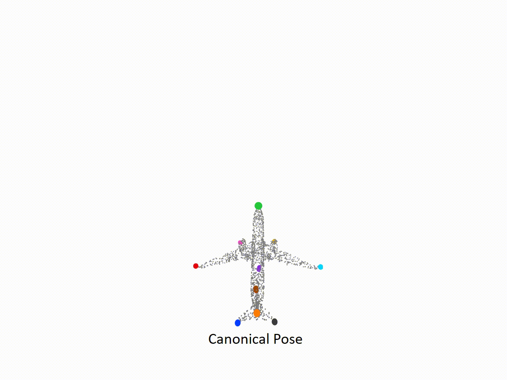
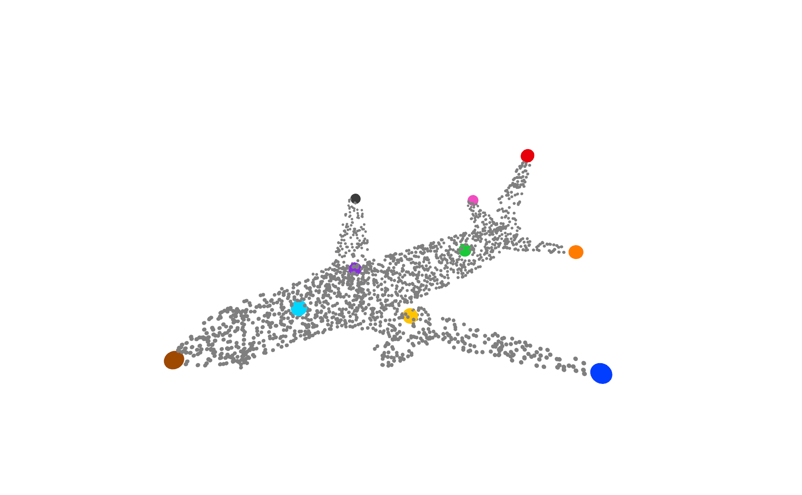
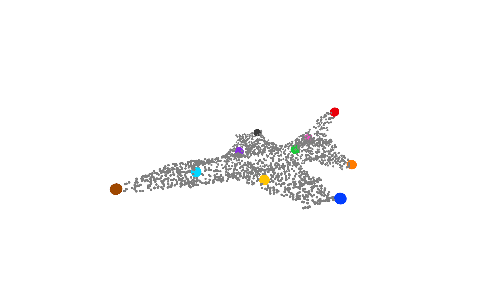
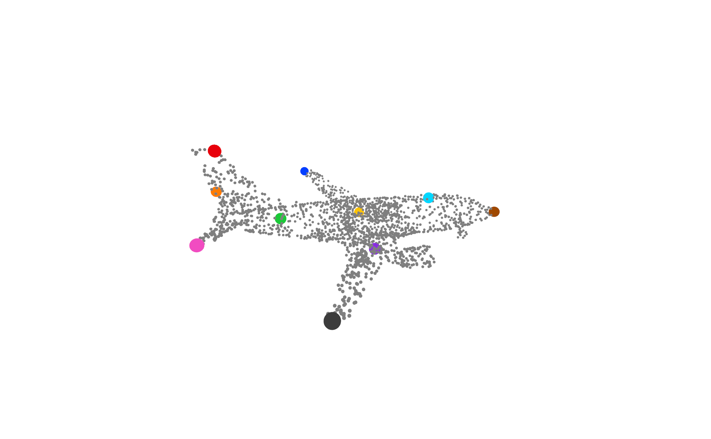
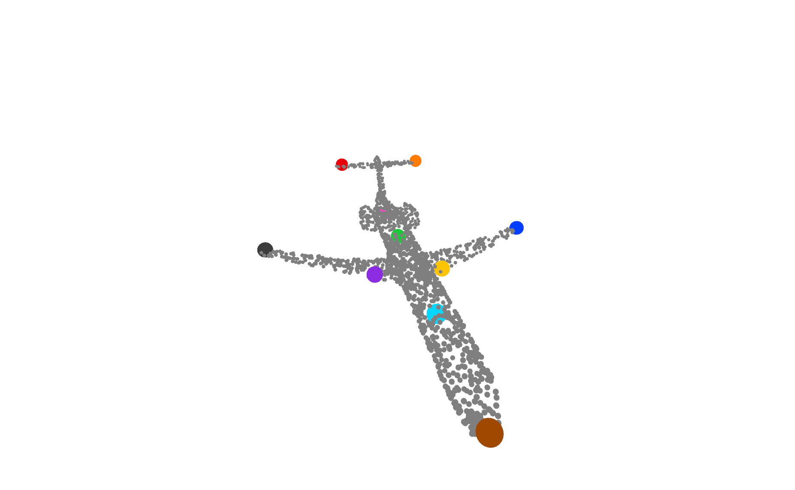

# SC3K
This repository contains the code of "[_**SC3K: Self-supervised and Coherent 3D Keypoints Estimation from Rotated, Noisy, and Decimated Point Cloud Data**_](https://openaccess.thecvf.com/content/ICCV2023/papers/Zohaib_SC3K_Self-supervised_and_Coherent_3D_Keypoints_Estimation_from_Rotated_Noisy_ICCV_2023_paper.pdf)", which has been accepted in the ICCV23.

**Authors:** [Mohammad Zohaib](https://zohaibmohammad.github.io/), [Alessio Del Bue](https://www.iit.it/it/people-details/-/people/alessio-delbue)

<!---   
      --> 

<p align="center">
  
</p>


**Abstract:**  
<p align="justify"> This paper proposes a new method to infer keypoints from arbitrary object categories in practical scenarios where point cloud data (PCD) are noisy, down-sampled and arbitrarily rotated. Our proposed model adheres to the following principles: i) keypoints inference is fully unsupervised (no annotation given), ii) keypoints position error should be low and resilient to PCD perturbations (robustness), iii) keypoints should not change their indexes for the intra-class objects (semantic coherence), iv) keypoints should be close to or proximal to PCD surface (compactness). We achieve these desiderata by proposing a new self-supervised training strategy for keypoints estimation that does not assume any a priori knowledge of the object class, and a model architecture with coupled  auxiliary losses that promotes the desired keypoints properties. We compare the keypoints estimated by the proposed approach with those of the state-of-the-art unsupervised approaches. 
The experiments show that our approach outperforms by estimating keypoints with improved coverage ($+9.41$%) while being semantically consistent ($+4.66$%) that best characterizes the object's 3D shape for downstream tasks. </p>


# Installation
We highly recommend running this project with a [conda environment](https://docs.conda.io/projects/conda/en/latest/user-guide/tasks/manage-environments.html). The code is tested on ```Python 3.6.12```, ```Torch 1.10.1```, ```Torchvision 0.11.2```. We recommend using ```Python 3.6+``` and installing all the dependencies as provided in "sc3k_environment.yml". Create a conda environment by following:
```
git clone https://github.com/IIT-PAVIS/SC3K.git
cd SC3K

conda env create -f sc3k_environment.yml
conda activate sc3k
```

# Training
  Set the training parameters using the configuration file "config/config.yaml". For example:
  ```
    split: train  # train the network
    task: generic # transform the PCDs to generic poses before training
    batch_size: 26 # batch size 
    class_name: airplane # category to train

  ```
  Run training as ```python train.py```. Follow the training progress using **train/class_name/**. The best weights will be saved in the same folder with the name **Best_class_name_10kp.pth**.
  
# Inference
  Set the parameters using the configuration file "config/config.yaml" as:
  ```
    split: test  # train the network
    task: generic # **generic** to test on random pose, and **canonical** to test performance on canonical PCDs 
    batch_size: 1 # batch size 
    class_name: airplane # category to train

    save_results: True # if you want to save qualitative results, otherwise keep it False
    data:
        best_model_path: '**please set the path of the best weights**'

  ```
  Please set the "best_model_path" as **train/class_name/Best_class_name_10kp.pth**, and inference as ```python test.py```. Follow the progress using **test/class_name/***
  
# Datasets
We use the KeypointNet dataset that can be downloaded from the [link](https://github.com/qq456cvb/KeypointNet). We use the following structure:
```
dataset/
  |_ annotation/airplane.json  (all.json that is available in the KeypointNet dataset can also be used)

  |_ pcds
      |__ 02691156
            |__ *.pcd (containing the PCDs in canonical pose)
            ...
      |__ id of the second class
      .
      .
      |__ id of the last class

  |_ poses
      |__ 02691156
            |__ *.npz (randomly generated 24 poses to transform the input PCDs for training)
            ...
      |__ id of the second class
      .
      .
      |__ id of the last class

  |_ splits
      |__ train.txt
      |__ val.txt
      |__ test.txt

```
Please download the data and keep it in the above structure. Poses containing intrinsic and extrinsic matrixes of the cameras can be generated by following any of the methods presented in [PointView-GCN](https://github.com/SMohammadi89/PointView-GCN) or [Occupency network](https://github.com/autonomousvision/occupancy_networks). We provide a sample set in the folder "dataset" for an initial start.


# Visualizations
To save the qualitative results (visualizations), you can run ```test.py```, keeping ```save_results: True``` in the "config.yml" file. You will find the output files in the "test/class_id/*_visualizations". The results should look like:

<p align="center">
   
</p>


## Cite us:
If you use this project for your research, please cite as:
```
@inproceedings{zohaib2023sc3k,
  title={SC3K: Self-supervised and Coherent 3D Keypoints Estimation from Rotated, Noisy, and Decimated Point Cloud Data},
  author={Zohaib, Mohammad and Del Bue, Alessio},
  booktitle={Proceedings of the IEEE/CVF International Conference on Computer Vision},
  pages={22509--22519},
  year={2023}
}

```

## Previous related works:
1. [3D Key-Points Estimation from Single-View RGB Images](https://link.springer.com/chapter/10.1007/978-3-031-06430-2_3)
2. [CDHN: Cross-Domain Hallucination Network for 3D Keypoints Estimation](https://papers.ssrn.com/sol3/papers.cfm?abstract_id=4349267)
   
## Acknowledgements:
We would like to acknowledge [Milind Gajanan Padalkar](https://www.iit.it/it/people-details/-/people/milind-padalkar), [Matteo Taiana](https://www.iit.it/it/people-details/-/people/matteo-taiana) and [Pietro Morerio](https://www.iit.it/it/people/pietro-morerio) for fruitful discussions, and [Seyed Saber Mohammadi](https://www.iit.it/it/people-details/-/people/seyed-mohammadi) and [Maryam Saleem](https://sites.google.com/view/maryamsaleem) for their support during the experimental phase. This work has been supported by the projects “RAISE-Robotics and AI for Socio-economic Empowerment” and “European Union-NextGenerationEU”.


